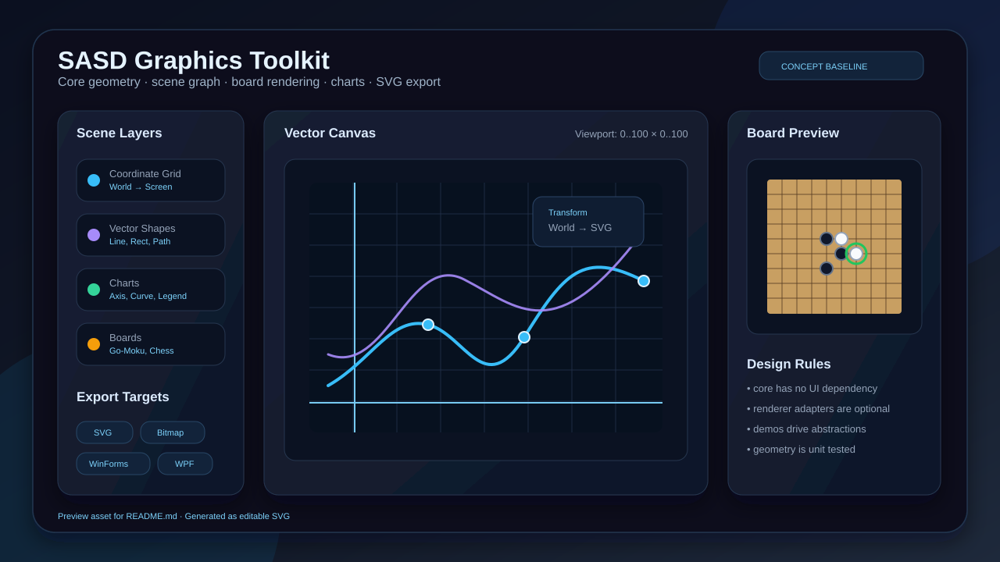

# SASD Graphics Toolkit

[](https://github.com/Robin-Goerlach/SASD-Graphics-Toolkit/actions/workflows/cmake.yml)


> Modernes C++-Grafik-, Visualisierungs- und Zeichenfundament für SASD-Projekte.

**Sprache:** Englisch ist die Standardsprache der Dokumentation. Diese Datei ist die deutsche Begleitfassung zu [README.md](README.md).



## Zielbild

**SASD Graphics Toolkit** soll eine kleine, saubere und erweiterbare C++20-Bibliothek für wiederverwendbare 2D-Grafikbausteine werden. Es ist nicht als vollständige Game Engine, komplettes GUI-Framework oder Ersatz für Qt, GTK, wxWidgets, Skia oder Cairo geplant.

Das Toolkit soll mehreren SASD-Projekten als Grafik-Unterbau dienen:

- **SASD GameWorks Lab:** Brettdarstellung, Kartenlayouts, Suchbaumansichten, Zuganalyse, Bewertungsverläufe.
- **SASD Numerics / Math Toolkit:** Funktionsplots, Achsen, Raster, Diagramme und numerische Visualisierung.
- **SASD UI Toolkit / UI Platform:** wiederverwendbare Zeichenmodelle, Geometrie, Themes, Raster und spätere Renderer-Adapter.
- **Lern- und Forschungsprojekte:** kompakte Beispiele für Geometrie, Transformationen, Rendering und algorithmische Visualisierung.

## Kernidee

Das Projekt trennt konsequent zwischen:

```text
Grafikmodell        -> was soll gezeichnet werden?
Layout/Koordinaten  -> wo und in welcher Skalierung?
Renderer-Backend    -> wie wird es ausgegeben oder angezeigt?
Anwendungslogik     -> warum wird es gezeichnet?
```

Dadurch soll dieselbe fachliche Szene später auf verschiedene Ziele gerendert werden können, zum Beispiel SVG, Bitmap, Win32/GDI+, Direct2D, Skia, Cairo, HTML Canvas oder ein experimentelles terminalnahes Backend.

## Geplante Feature-Bereiche

| Bereich | Geplanter Umfang |
|---|---|
| **Core Geometry** | Punkte, Vektoren, Größen, Rechtecke, Bounds, Linien, Kreise, Polygone |
| **Coordinate Mapping** | Weltkoordinaten, Ausgabe-Koordinaten, Viewports, Transformationen |
| **Scene Model** | Szenen, Layer, Formen, Text, Styles, stabile IDs |
| **Rendering** | zuerst SVG, später Bitmap und native Backends |
| **Boards & Grids** | Go-Moku-Brett, Schachbrett, generische Raster, Hit-Testing |
| **Charts** | Achsen, Polylines, Scatterplots, einfache Legenden |
| **Demos** | kleine Beispiele statt eines großen Demo-Monolithen |
| **Tests** | Geometrie, Mapping, Szenenmodell, SVG-Ausgabe, Brett-Mapping |

## Abgrenzung

Das Toolkit soll keine Spielregeln, Schachlogik, Go-Moku-KI, Bridge-Bietlogik oder numerischen Algorithmen enthalten. Diese gehören in eigene Projekte. Dieses Repository konzentriert sich auf Visualisierung und Rendering-Infrastruktur.

```text
SASD.GameWorksLab        -> Spielregeln, KI, Spielzustände
SASD.Numerics.Core       -> Mathematik, Statistik, numerische Verfahren
SASD.Graphics.Toolkit    -> Zeichenmodelle, Koordinaten, Rendering, Visualisierung
SASD.UI.Toolkit          -> Interaktionskonzepte und UI-Widgets
```

## Repository-Struktur

```text
include/    öffentliche C++-Header
src/        Implementierungsdateien
tests/      zukünftige Unit- und Regressionstests
docs/       englische Dokumentation plus deutsche Begleitdokumente
assets/     Screenshots, Diagramme und visuelles Material
```

## Erste sinnvolle Demo

Als erste Demo eignet sich ein **Go-Moku-Brett-Renderer**:

- 19 × 19 Raster
- Steine als einfache Kreise
- Marker für den letzten Zug
- Beschriftung A–S / 1–19
- Mapping von Maus-/Ausgabeposition auf Brettkoordinate
- SVG-Export

## Dokumentation

| Englisch | Deutsch |
|---|---|
| [docs/README.md](docs/README.md) | [docs/README.de.md](docs/README.de.md) |
| [docs/000_Project_Overview.md](docs/000_Project_Overview.md) | [docs/000_Project_Overview.de.md](docs/000_Project_Overview.de.md) |
| [docs/010_Feature_Catalog.md](docs/010_Feature_Catalog.md) | [docs/010_Feature_Catalog.de.md](docs/010_Feature_Catalog.de.md) |
| [docs/020_Architecture.md](docs/020_Architecture.md) | [docs/020_Architecture.de.md](docs/020_Architecture.de.md) |
| [docs/030_Roadmap.md](docs/030_Roadmap.md) | [docs/030_Roadmap.de.md](docs/030_Roadmap.de.md) |
| [docs/040_Integration_GameWorks_Numerics.md](docs/040_Integration_GameWorks_Numerics.md) | [docs/040_Integration_GameWorks_Numerics.de.md](docs/040_Integration_GameWorks_Numerics.de.md) |
| [docs/090_Conversation_Context.md](docs/090_Conversation_Context.md) | [docs/090_Conversation_Context.de.md](docs/090_Conversation_Context.de.md) |
| [AGENTS.md](AGENTS.md) | [AGENTS.de.md](AGENTS.de.md) |
| [CONTRIBUTING.md](CONTRIBUTING.md) | [CONTRIBUTING.de.md](CONTRIBUTING.de.md) |

Die Dateien `090_Conversation_Context*` bewahren nützlichen Hintergrund aus der breiteren GameWorks-Diskussion. Sie sind bewusst nicht normativ; neuere Architekturtexte, ADRs und implementierter Code haben Vorrang.

## Build-Basis

```bash
cmake -S . -B build
cmake --build build
ctest --test-dir build
```

## Status

Aktueller Status: **Konzept-Baseline / Repository-Fundament**.

Es gibt noch keine stabile API und keine produktionsreife Implementierung.

## Lizenz

Dieses Repository steht unter der **MIT License**. Siehe [LICENSE](LICENSE). Eine nicht maßgebliche deutsche Lesehilfe steht in [LICENSE.de.md](LICENSE.de.md); rechtlich maßgeblich bleibt die englische Datei `LICENSE`.

## Leitmotiv

> Zeichne nicht nur Pixel. Zeichne Modelle, die man verstehen, testen und wiederverwenden kann.
