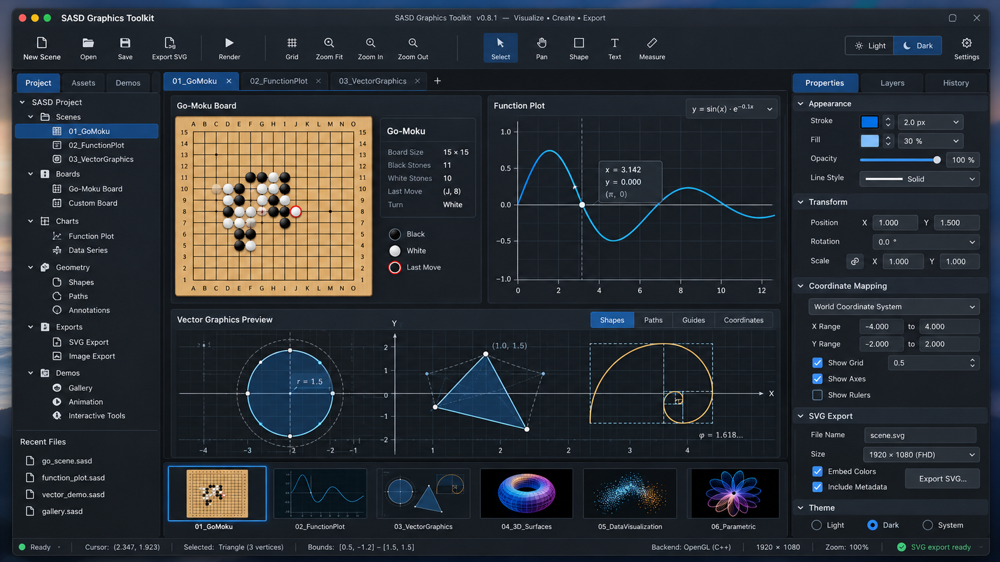

# SASD Graphics Toolkit

[](https://github.com/Robin-Goerlach/SASD-Graphics-Toolkit/actions/workflows/cmake.yml)


Wiederverwendbarer 2D-Grafik- und Visualisierungs-Unterbau für SASD-Projekte.
**Englisch ist die Standardsprache. [English](README.md).**



## Umfang
Szenen, Stile, visuelle Koordinaten, Renderer-Adapter, Boards/Grids und kleine Diagramme.
SVG ist der erste geplante Renderer. Spielregeln/KI, numerische Algorithmen und
UI-Framework-Core-Logik bleiben in eigenen Projekten. Der Core bleibt UI-unabhängig.

## Zwei unabhängige Sprachdimensionen
C++20/CMake ist die erste Implementierungsrichtung. C#/.NET ist als gleichrangige
Variante geplant, nicht zwingend als C++-Wrapper. Weitere Plattformbäume kommen hinzu.
Englische/deutsche Dokumentation ist unabhängig von der Implementierungssprache.
Gemeinsames Verhalten liegt in `spec/`; APIs bleiben plattformtypisch.
Der Aufbau folgt dem [SASD Math Toolkit](https://github.com/Robin-Goerlach/SASD-Math-Toolkit).

## Repository-Aufbau
| Pfad | Zweck |
|---|---|
| `src/cpp/` | Gerüst der ersten C++20-Implementierung |
| `src/dotnet/` | geplante gleichrangige C#/.NET-Implementierung |
| `tests/cpp/`, `tests/dotnet/` | plattformspezifische Tests |
| `samples/cpp/`, `samples/dotnet/` | plattformspezifische Beispiele |
| `spec/` | gemeinsame Verträge und Referenzdaten |
| `docs/en/`, `docs/de/` | Dokumentationssprachen |
| `resources/i18n/` | künftige lokalisierte Textkataloge |
| `assets/` | gemeinsame Bilder und Medien |

Öffentliche C++-Header werden unter `src/cpp/include/sasd/graphics/` liegen.
Root-`include/` und bisherige nummerierte Dokumentpfade behalten Migrationshinweise.
Keine übersetzten Kopien des Bibliotheksquellcodes.

## Aktueller Stand
**Ausschließlich Repository-Grundlage.** Noch keine Grafikbibliothek, Renderer,
ausführbaren Beispiele, .NET-Projekte oder Pakete implementiert.
CMake/CTest konfigurieren das C++-Gerüst und prüfen Repository-/Dokumentationsverträge.
Die vier gemeinsamen affinen Referenzfälle sind Daten; noch führt kein C++-/.NET-Runner sie aus.
Leere englische/deutsche Textkataloge bedeuten keine funktionierende Laufzeitlokalisierung.
Siehe [Sprachunterstützung](docs/de/070_Language_Support.md).

## Konfiguration, Prüfung und Build
Voraussetzungen: CMake >= 3.22, C++20-fähiger Compiler und Python >= 3.10 bei aktiven Prüfungen.
.NET ist für das C++-Gerüst nicht erforderlich.

```bash
python3 tools/check_repository.py
cmake -S . -B build -DSASD_GRAPHICS_BUILD_TESTS=ON
cmake --build build --config Release
ctest --test-dir build --output-on-failure -C Release
```

Windows: `python` verwenden, falls die Installation kein `python3` bereitstellt.
Mit `-DSASD_GRAPHICS_BUILD_TESTS=OFF` entfällt die Python-Anforderung.
Noch existieren keine Bibliotheks-/Beispiel-Buildziele.

## Dokumentation
- [English index](docs/en/README.md) / [Deutscher Index](docs/de/README.md)
- [Architektur und Entscheidungen](docs/de/020_Architecture.md)
- [Mehrsprachiger Entwicklungsablauf](docs/de/050_Multilanguage_Development.md)
- [Gemeinsame Verträge](docs/de/060_Contracts.md)
- [Roadmap](docs/de/030_Roadmap.md)
- [Math-/GameWorks-/UI-Integration](docs/de/040_Integration_GameWorks_Numerics.md)
- [Historischer GameWorks-Diskussionskontext](docs/de/090_Conversation_Context.md)
- [Development rules](AGENTS.md) / [Arbeitsregeln](AGENTS.de.md)
- [Contributing](CONTRIBUTING.md) / [Beiträge](CONTRIBUTING.de.md)

Math verantwortet wiederverwendbare Mathematik; Graphics visualisiert.
Eine kleine Math-Geometrieabhängigkeit ist vorgeschlagen; Paket und
Interoperabilitätsgrenze sind noch nicht ausgewählt.
Der Math-Core bleibt unabhängig von Graphics.
Historischer Diskussionskontext ist nicht normativ; aktuelle Architekturentscheidungen haben Vorrang.

## Erste geplante Demo
Kleines 19 × 19-Go-Moku-Board mit SVG-Export, Steinen, letztem Zug, Beschriftungen
und Koordinaten-Mapping. Spielregeln bleiben außerhalb von Graphics.

## Lizenz
MIT: [LICENSE](LICENSE). [Deutsche Lesehilfe](LICENSE.de.md);
die englische LICENSE ist maßgeblich.
